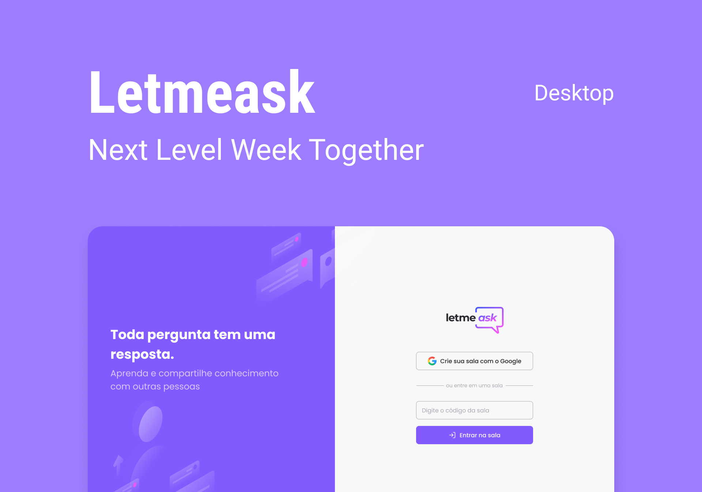
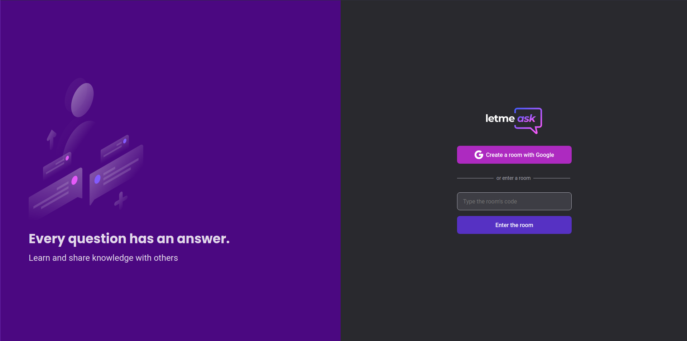
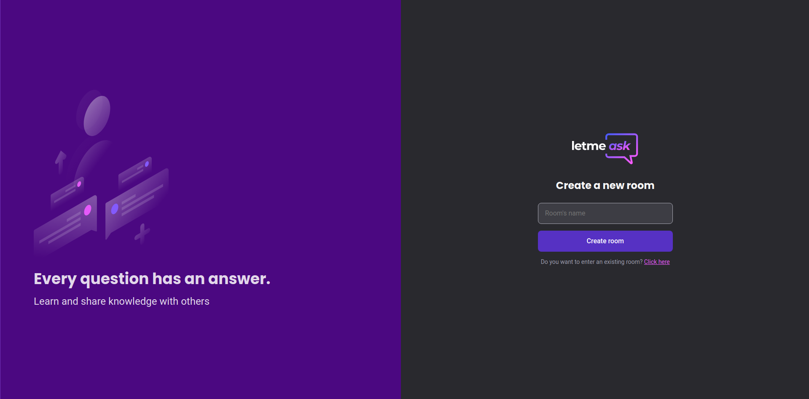
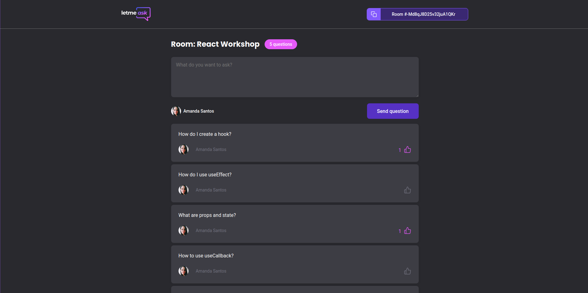
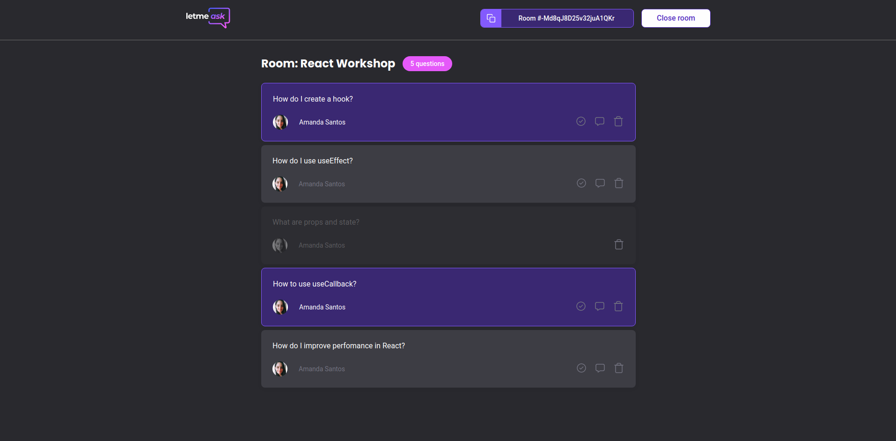

<h1 align="center">
    
</h1>

	Letmeask is an application with the goal of helping people to share knowledge by creating rooms, posting and answering questions. Developed during Rocketseat's Next Level Week Together.
     
    Deployed <a href="https://letmeask-f1a57.web.app/">here</a>.

  
  
  
  
  
  
  

  <a href="#-techs">Techs</a>&nbsp;&nbsp;&nbsp;|&nbsp;&nbsp;&nbsp;
  <a href="#-techs">Preview</a>&nbsp;&nbsp;&nbsp;|&nbsp;&nbsp;&nbsp;
  <a href="#-usage">Usage</a>&nbsp;&nbsp;&nbsp;|&nbsp;&nbsp;&nbsp;
  <a href="#-contributing">Contributing</a>&nbsp;&nbsp;&nbsp;

## 👩🏻‍💻 Techs

This project was developed with the following technologies:

- React.js
- Typescript
- HTML5
- Sass
- Firebase: Realtime Database and Hosting

## 💻 Preview

  
  
  
  

## 🖱 Usage

1. Run `npm i` or `yarn` to install the dependencies
2. Run the server with `npm run server` or `yarn server`
3. Run the application with `npm run dev` or `yarn dev`
4. Access `http://localhost:3000`

## 🤔 Contributing

1. _Fork_ this repository (<https://github.com/amanda-santos/letmeask/fork>)
2. Create a _branch_ for your changes (`git checkout -b feature/fooBar`)
3. _Commit_ (`git commit -am 'Add some fooBar'`)
4. _Push_ (`git push origin feature/fooBar`)
5. Create a new _Pull Request_
